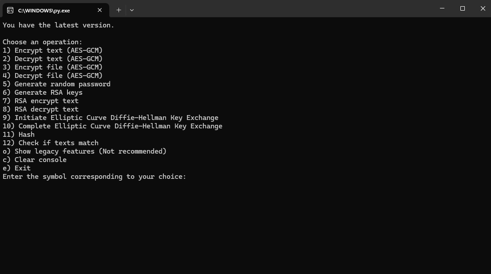
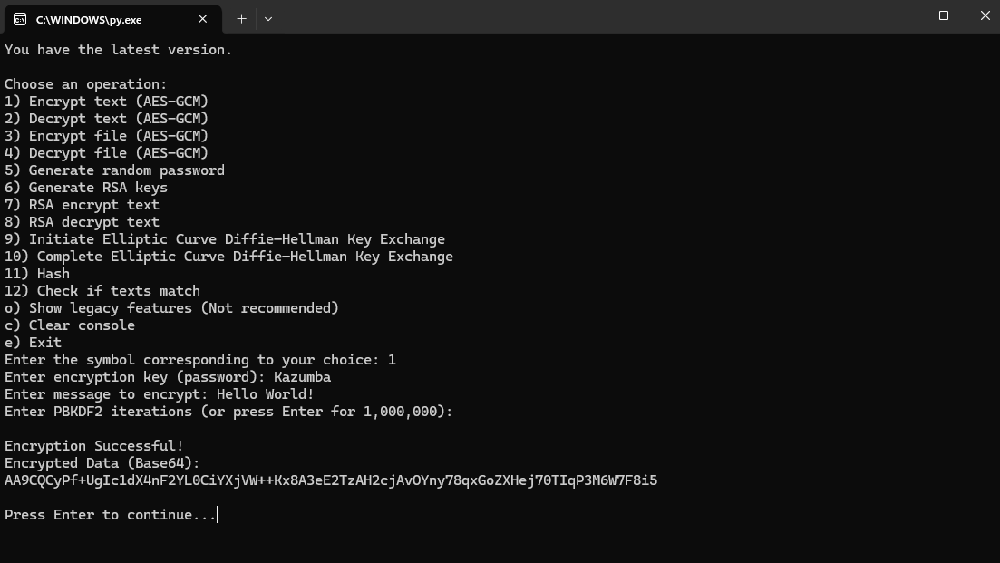
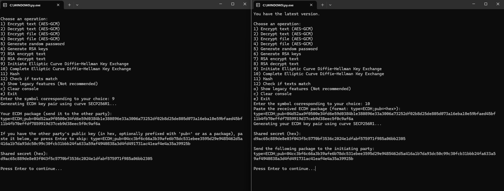

# KazCrypt - Secure Encryption

KazCrypt is a lightweight python encryption program designed for secure text and file encryption.

Contact - Discord - kazumba_2137

# Functions

- you can press "4" to display how to use these tools

- text encryption/decryption

- file encryption/decryption

- Strong password generation

- generating RSA keys

- encryption/decryption using RSA keys

- has DH and ECDH key exchanges (will be explained later in the readme on 14-03-2025)

- can hash file or text with 19 avaliable hashing algorythms

- can check if 2 hashes (or any character string) are the same 

- communication session for easy communication (Learn more using "how to use?" function)

- base64 to file convertor and file to base64 convertor

- tool for spliting a file into 9mb parts to bypass discord limit

# Usage

Run KazCrypt_v1.3.2_InstallRequirements.bat to install requirements, or you can change the .bat to .txt and install them manually

Open KazCrypt v1.3.2.py file with python 3.13

Then if everything is working, a windows should pop up, where you can select an operation, e.g. 1) Encrypt text

To choose an operation just enter symbol corresponding to your choice, and click enter, in case of Encrypting text just type 1, and click enter

Next, follow the prompts and enter the required information as requested. For example, you'll need to provide the text you want to encrypt, along with any necessary encryption keys or settings.

After doing everything right, you should get the output (encrypted text/file)

Note that if generating RSA keys or generating dh packets, it can take a bit on older computers, but dont worry, it's not frozen

# How it looks?

This is the main menu:

This is an example of encrypting text:

This is how key exchange looks like:

# How to use key exchange?

To initiate an ECDH exchange:

Choose the option “Initiate Elliptic Curve Diffie–Hellman Key Exchange”

Copy the generated package and send it to your communication partner

Do not close the script

.

To complete the ECDH exchange:

Choose the option "Complete Elliptic Curve Diffie–Hellman Key Exchange"

Paste the package received from your partner

The script will then generate your key pair, compute the shared secret, and display your key package

Send your key package back to your partner

.

To calculate the shared secret for the initiating party:

After receiving the responder's package, you have to paste it

Then it will compute shared secret for the initiating party

