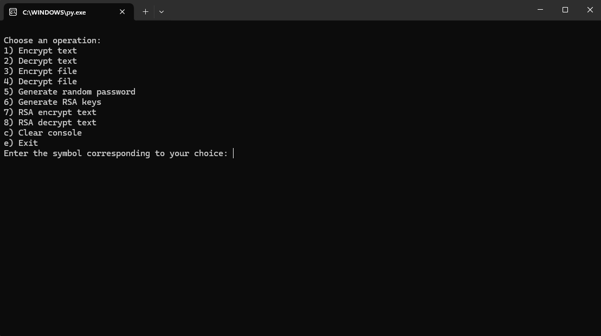
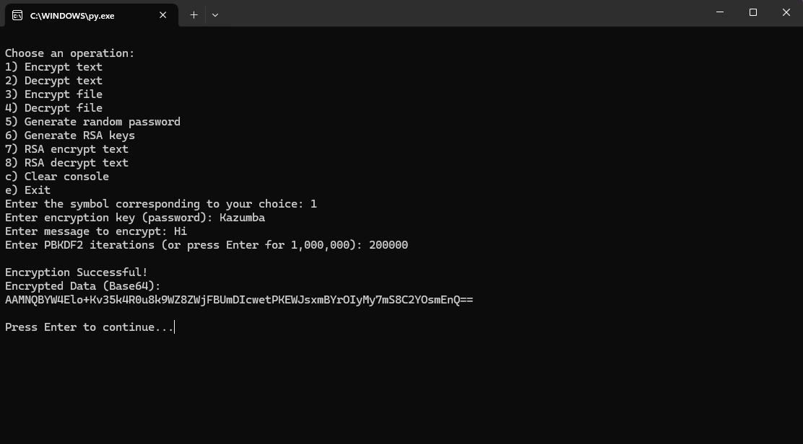

# KazCrypt - Secure Encryption
More Updates on 14th of March 2025 (14-03-2025)

KazCrypt is a lightweight python encryption program designed for secure text and file encryption.

Contact - Discord - kazumba_2137

# Functions

-text encryption/decryption

-file encryption/decryption

-Strong password generation

-generating RSA keys

-encryption/decryption using RSA keys

-has DH and ECDH key exchanges (will be explained later in the readme on 10-03-2025)

-can hash file or text with 19 avaliable hashing algorythms

-can check if 2 hashes (or any character string) are the same 

# Usage

Run KazCrypt_v1.1.0_InstallRequirements.bat to install requirements, or you can change the .bat to .txt and install them manually

Open KazCrypt v1.1.0.py file with python 3.13

Then if everything is working, a windows should pop up, where you can select an operation, e.g. 1) Encrypt text

To choose an operation just enter symbol corresponding to your choice, and click enter, in case of Encrypting text just type 1, and click enter

Next, follow the prompts and enter the required information as requested. For example, you'll need to provide the text you want to encrypt, along with any necessary encryption keys or settings.

After doing everything right, you should get the output (encrypted text/file)

Note that if generating RSA keys, it can take a bit on older computers, but dont worry, it's not frozen

# How it looks?

This is the main menu:

This is an example of encrypting text:

